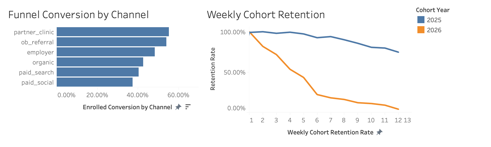

# Maternal Growth & Retention Analytics

End-to-end healthcare growth analytics simulation built with PostgreSQL, Python, SQL 
and Tableau.

This project models how a maternal health startup tracks patient acquisition, enrollment conversion, engagement, and retention to 
quantify business performance and patient outcomes.

Designed to mirror workflows used by healthcare growth and product analytics teams.

The system generates synthetic lifecycle data (1,000 patients, 10k+ engagement events) and implements production-style SQL analytics 
queries to calculate funnel conversion, cohort retention, and operational KPIs.

## Business Context

Healthcare growth teams must understand:

- Which acquisition channels drive the highest enrollment?
- Where patients drop off in the funnel?
- How retention differs across cohorts?
- Which risk segments churn at higher rates?
- How engagement behaviors relate to patient retention?

This project simulates a real-world growth analytics workflow to answer those questions using a structured star schema and SQL-based KPI 
modeling.

## Tech Stack

- PostgreSQL (relational database + star schema)
- SQL (analytics & KPI modeling)
- Python (synthetic data generation + ETL)
- SQLAlchemy
- Pandas

## Dashboard Preview



## Key Metrics Modeled

- Lead → Enrollment conversion rate
- Funnel stage drop-off rates
- Weekly cohort retention (Week 0–12)
- Active patient rate
- Channel-level performance
- Engagement event frequency

## Example Insights 

- Partner clinic and OB referral channels produced the highest enrollment conversion 
rates.
- Cohort retention diverged significantly after week 4, suggesting onboarding 
quality differences.
- Higher engagement frequency correlated with stronger long-term retention.

## Project Structure

```
maternal-growth-analytics/
│
├── sql/
│   ├── ddl/              # Schema definitions
│   └── analytics/        # Funnel & retention queries
│
├── src/                  # Data generation scripts
├── requirements.txt
└── README.md
```

## Quickstart (Local)

### 1. Setup environment
```bash
python3 -m venv venv
source venv/bin/activate
pip install -r requirements.txt
```

### 2. Create database schema
```bash
psql -d maternal_growth -f sql/ddl/01_create_tables.sql
psql -d maternal_growth -f sql/ddl/02_core_tables.sql
psql -d maternal_growth -f sql/ddl/03_seed_channels.sql
```

### 3. Generate synthetic data
```bash
python src/load_patients.py
python src/load_lifecycle_and_events.py
```

### 4. Run analytics queries
```bash
psql -d maternal_growth -f sql/analytics/01_funnel_conversion_by_channel.sql
psql -d maternal_growth -f sql/analytics/02_weekly_cohort_retention.sql
```

## Future Extensions

- dbt modeling layer
- A/B test simulation framework
- Churn prediction model
- Marketing attribution modeling

## Example Scale

- 1,000 simulated patients
- 10,000+ engagement events
- 466 enrolled patients
- 6 acquisition channels
- 12-week retention tracking

